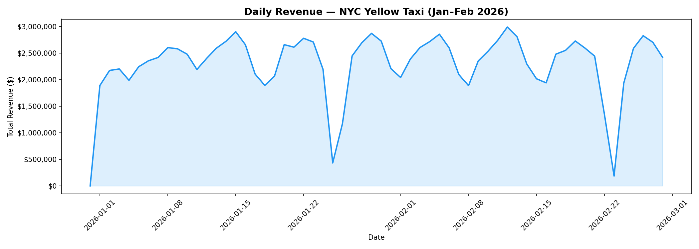
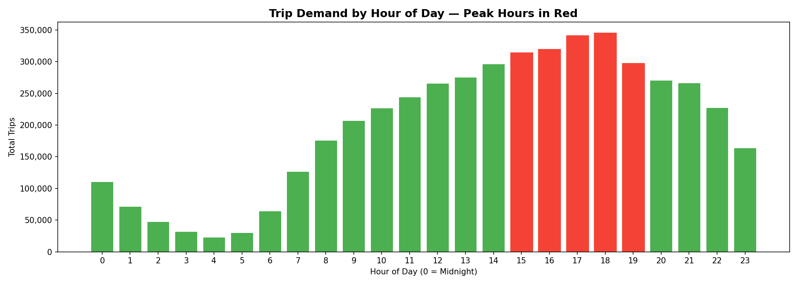
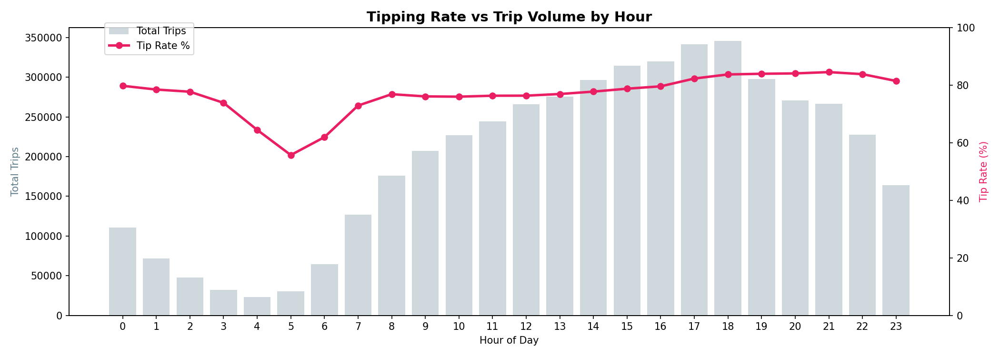

# nyc-taxi-data-engineering
End-to-end Data Engineering pipeline built with PySpark and SparkSQL on Databricks — Medallion Architecture (Bronze/Silver/Gold)
# 🚕 NYC Taxi Data Engineering Pipeline

An end-to-end Data Engineering project built on **Databricks** using 
**PySpark**, **SparkSQL**, and **Medallion Architecture** 
(Bronze → Silver → Gold).

---

## 📌 Project Overview

This pipeline ingests, cleans, transforms, and analyzes 2M+ real NYC 
Yellow Taxi trip records from Jan–Feb 2026. It demonstrates production-grade 
Data Engineering patterns including partitioning, broadcast joins, 
window functions, and multi-layer data lake design.

---

## 🏗️ Architecture
Raw Parquet Files (NYC TLC)
↓
[Bronze Layer] — Raw ingestion, schema validation, timestamp added
↓
[Silver Layer] — Cleaned, filtered, feature engineered, partitioned by month
↓
[Gold Layer]   — Aggregated KPI tables, business-ready, query-optimized
↓
[Visualizations] — Matplotlib charts exported from Pandas

---

## 📊 Key KPIs & Insights

- 📈 **Daily Revenue Trend** — Revenue pattern across Jan–Feb 2026
- 🕐 **Peak Hour Demand** — Highest trip volume between 6PM–8PM
- 📅 **Day of Week Analysis** — Friday generates highest weekly revenue
- 💳 **Payment Split** — 70%+ trips paid by credit card
- 💰 **Tipping Behaviour** — Tip rate highest in early morning hours
- 🚦 **7-Day Moving Average** — Smoothed demand trend over time
- 📦 **Fare Quartile Analysis** — Higher fare trips correlate with higher tips

---

## 🛠️ Tech Stack

| Tool | Purpose |
|------|---------|
| PySpark | Distributed data processing |
| SparkSQL | SQL-based transformations & KPIs |
| Databricks (Serverless) | Cloud compute platform |
| Parquet | Columnar storage format |
| Pandas | Aggregated data export & visualization |
| Matplotlib | Chart generation |
| dbutils | File system management on Databricks |

---

## 📁 Data Lake Structure
/Volumes/workspace/default/taxi_data/
├── bronze/     → Raw combined Parquet (with ingestion timestamp)
├── silver/     → Cleaned, partitioned by pickup_month
├── gold/       → 12 aggregated KPI tables
├── charts/     → 7 exported PNG visualizations
└── exports/    → CSV summaries for reporting

---

## ⚙️ Pipeline Notebooks

| Notebook | Description |
|----------|-------------|
| `01_bronze_ingestion` | Ingest raw Parquet, profile nulls, write Bronze layer |
| `02_silver_transformation` | 10+ cleaning rules, feature engineering, partition by month |
| `03_gold_kpis` | 6 KPI tables via SparkSQL (GROUP BY, CASE WHEN, OVER()) |
| `04_advanced_sql` | Window functions, CTEs, LAG, RANK, NTILE, partition pruning |
| `05_optimization` | Broadcast joins, explain plans, repartition vs coalesce |
| `06_visualizations` | 7 Matplotlib charts exported from Gold layer via Pandas |

---

## 🔍 Advanced SQL Concepts Demonstrated

- `RANK()` / `DENSE_RANK()` with `PARTITION BY`
- `LAG()` for day-over-day revenue change
- `SUM() OVER (ROWS BETWEEN...)` for running totals
- `AVG() OVER (ROWS BETWEEN 6 PRECEDING...)` for 7-day moving average
- `NTILE(4)` for fare quartile bucketing
- Multi-level CTE chaining
- `QUALIFY` clause for post-window filtering

---

## ⚡ Optimization Techniques Applied

- **Broadcast joins** for small lookup tables — eliminates shuffle
- **Partition pruning** — reads only relevant month folders
- **Repartition by column** before partitioned writes — avoids tiny file problem
- **Coalesce** before small dataset writes
- **Explain plans** used to verify BroadcastHashJoin vs SortMergeJoin
- **Temp views** for repeated query optimization on serverless compute

---

## 📸 Sample Charts

### Daily Revenue Trend

### Hourly Demand — Peak Hours

### Tipping Rate by Hour

---

## 📂 Dataset Source

[NYC TLC Trip Record Data](https://www.nyc.gov/site/tlc/about/tlc-trip-record-data.page)  
Yellow Taxi — January & February 2026

---

## 👤 Author

**[Your Name]**  
BTech CSE (Data Science) | Data Engineering  
[LinkedIn](your-linkedin-url) • [GitHub](your-github-url)
